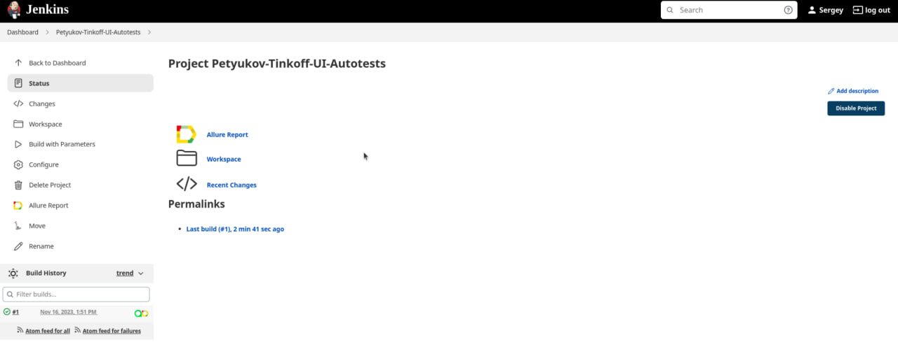
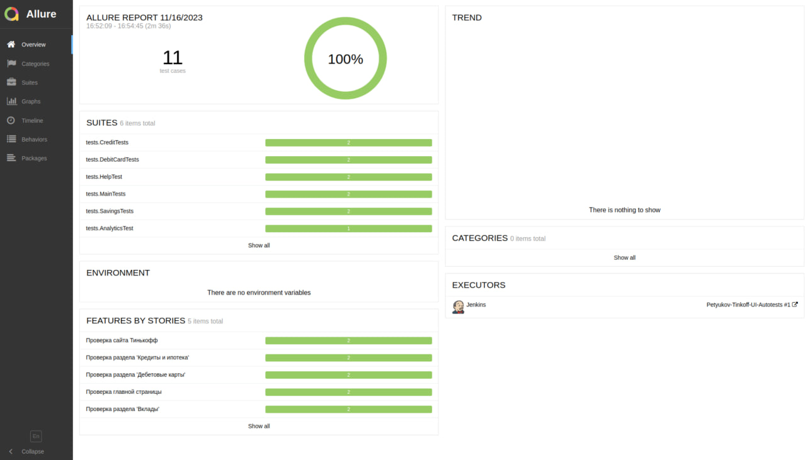

# Проект автоматизации тестов для сайта компании [Tinkoff](https://www.tinkoff.ru)
<p align="center"><a href="https://www.tinkoff.ru"></a></p>

## 💻 What i use
<p align="center">
<a href="https://www.java.com/"></a>
<a href="https://www.jetbrains.com/idea/"></a>
<a href="https://www.github.com/"></a>
<a href="https://www.gradle.org/"></a>
<a href="https://www.junit.org/junit5/"></a>
<a href="https://www.selenide.org/"></a>
<a href="https://www.aerokube.com/selenoid/"></a>
<a href="https://www.jenkins.io/"></a>
<a href="https://github.com/allure-framework/allure2"></a>
<a href="https://www.qameta.io/"></a>
<a href="https://www.atlassian.com/software/jira"></a>
<a href="https://www.telegram.org/"></a>
</p>

##  Сборка в [Jenkins](https://jenkins.autotests.cloud/job/tinkoff_autotests_kpoludnitsyn_new/)

<p align="center">

</p>

### Параметры сборки проекта

| Параметр        | Назначение                               |
|-----------------|------------------------------------------|
| REMOTE_URL      | Удаленный сервер для запуска тестов      |
| BROWSER         | Браузер для запуска                      |
| BROWSER_VERSION | Версия браузера                          |
| BROWSER_SIZE    | Разрешение экрана                        |
| BASE_URL        | Адрес сайта                              |
| TASK            | Опция выбора запуска определённых тестов |


##  Команды для запуска

### Локальный запуск

```
gradle clean test
```

### Удаленный запуск
```
clean
${TASK}
-Dbrowser=${BROWSER}
-DbrowserSize=${BROWSER_SIZE}
-DbrowserVersion=${BROWSER_VERSION}
-DbaseUrl=${BASE_URL}
-DremoteUrl=${REMOTE_URL}
```

##  [Allure](https://jenkins.autotests.cloud/job/Petyukov-Tinkoff-UI-Autotests/1/allure/) отчет

### Главная страница отчета

<p align="center">

</p>


